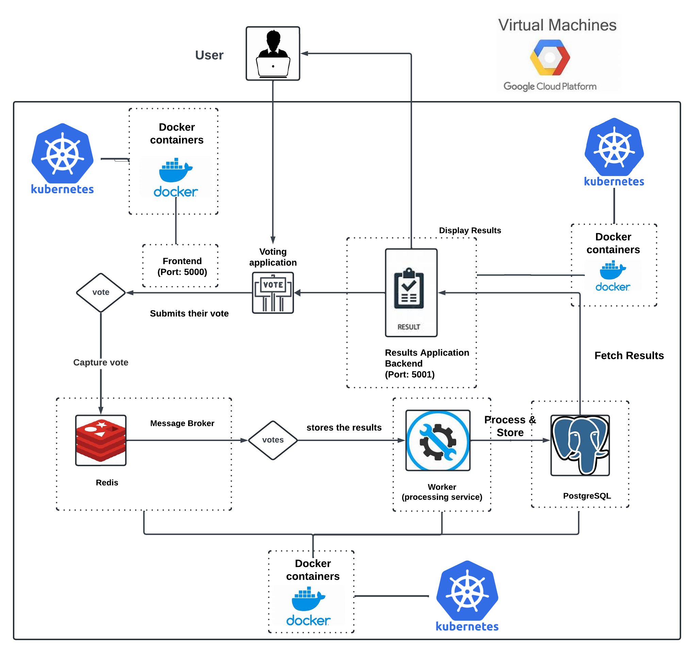
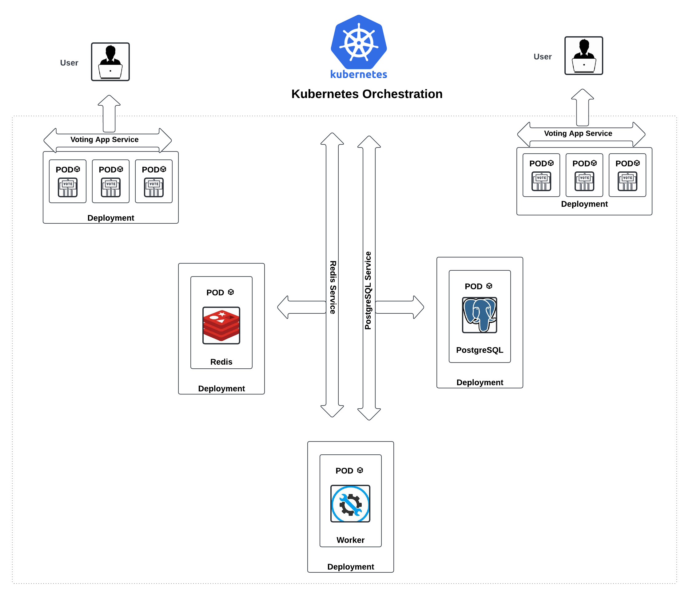

# Online Exam Voting

A simple distributed application running across multiple Docker containers.

## Getting started

Download [Docker Desktop](https://www.docker.com/products/docker-desktop) for Mac or Windows. [Docker Compose](https://docs.docker.com/compose) will be automatically installed. On Linux, make sure you have the latest version of [Compose](https://docs.docker.com/compose/install/).

This solution uses Python, Node.js, .NET, with Redis for messaging and Postgres for storage.

## Run the app in Kubernetes

The folder k8s-specifications contains the YAML specifications of the Voting App's services.

Run the following command to create the deployments and services. Note it will create these resources in your current namespace (`default` if you haven't changed it.)

```shell
kubectl create -f puru-k8s-with-loadbalancer/
```

The `vote` web app is then available on port 31000 on each host of the cluster, the `result` web app is available on port 31001.

To remove them, run:

```shell
kubectl delete -f puru-k8s-with-loadbalancer/
```

## Architecture




* A front-end web app in [Python](/vote) which lets you vote between two options
* A [Redis](https://hub.docker.com/_/redis/) which collects new votes
* A [.NET](/worker/) worker which consumes votes and stores them in…
* A [Postgres](https://hub.docker.com/_/postgres/) database backed by a Docker volume
* A [Node.js](/result) web app which shows the results of the voting in real time

## Notes

The voting application only accepts one vote per client browser. It does not register additional votes if a vote has already been submitted from a client.

This isn't an example of a properly architected perfectly designed distributed app... it's just a simple
example of the various types of pieces and languages you might see (queues, persistent data, etc), and how to
deal with them in Docker at a basic level.
